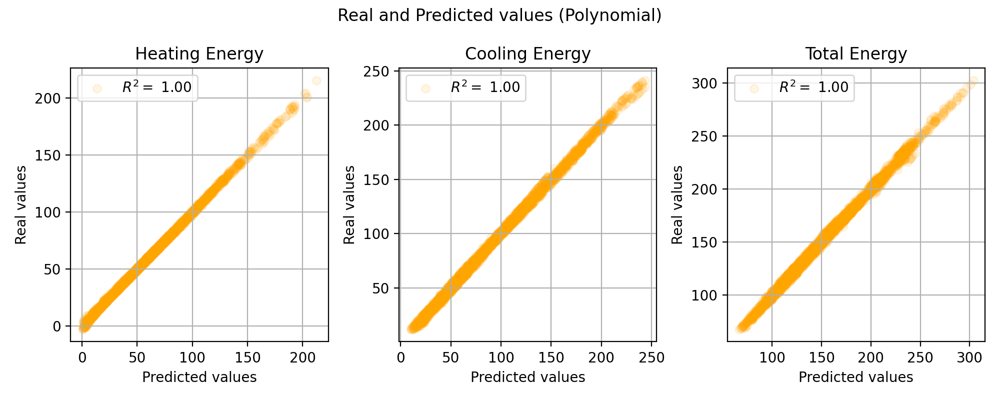
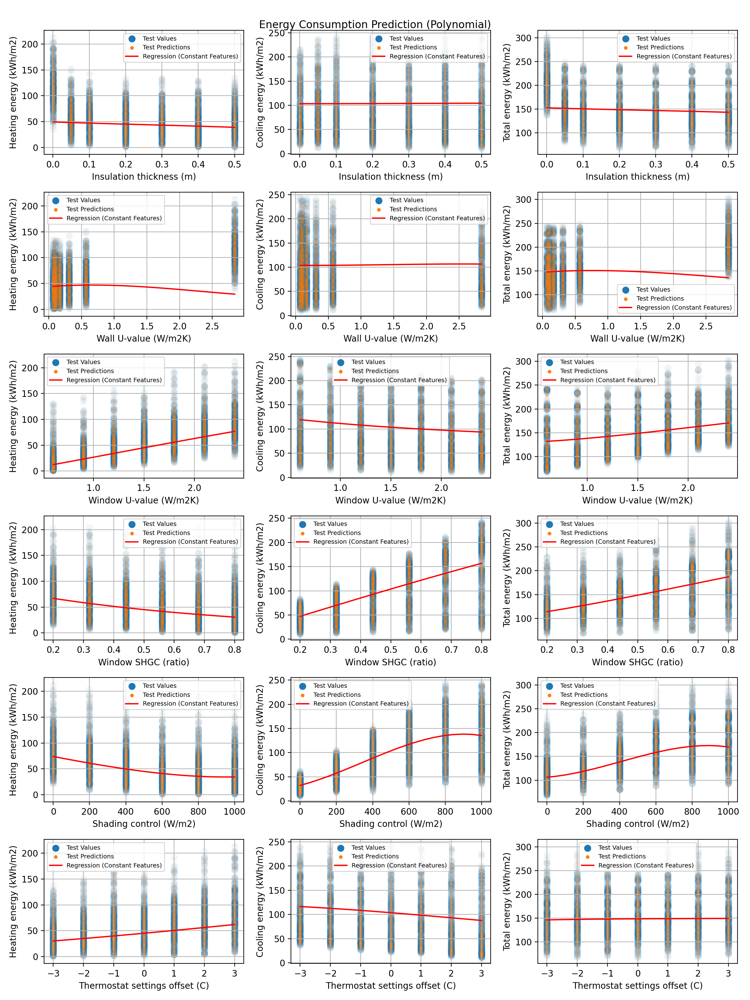

# RoomEnergySimulation
Simulating a rooms energy consumption for VR applications based on simulation results.

About 11,000 different parameter combinations for different input features have been simulated. In this repository, the results of these simulations are used to interpolate between those parameters and provide good energy consumption estimates for arbitrary parameter values without long computation times.

Simulation Inputs (all combinations have been simulated):
- Wall insulation thickness (m) = [0.001, 0.05, 0.10, 0.20, 0.30, 0.40, 0.50] – 7 values
- Window U-value (W/m2K) = [1.25, 1.05, 0.85, 0.65, 0.45, 0.25] – 6 values
- Window SHGC (ratio) = [0.20, 0.32, 0.44, 0.56, 0.68, 0.80] – 6 values
- Window shading control (W/m2) = [0, 200, 400, 600, 800, 100] – 6 values
- Cooling/heating thermostat setpoints (C) = [-3, -2, -1, 0, +1, +2, +3] – 7 values

Requested by Gerald at 18.04.2023.

# Model Training
See *simulate_energy_consumption.ipynb* for more details
- Prediction on Heating Energy, Cooling Energy and Total Energy
- R2 and MSE used for evaluation

# Visualization
- Multivariate Regression: Visualization is difficult
- One variable is plotted on the x-axis while others are held constant at their median values

# Problems
- Different models have their own advantages and disadvantages
- DecisionTreeRegressor: Good result, but visible "steps" in output plot, [see here in section "DecisionTreeRegressor"](simulate_energy_consumption.ipynb)
- Reason: Some models do not work well with a limited number of training input values

# ToDo
- Repeat simulation with randomly selected input data instead of using predefined input values

# Best model
- Best performance obtained with a linear model with third degree polynomial functions

